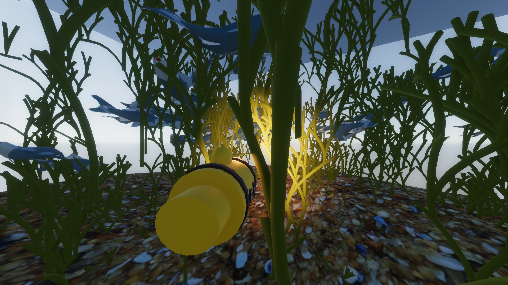
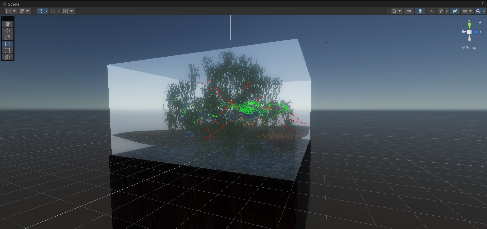

# Aquarium
A simple game featuring 3D submarine movement inside a glass box. The environment is populated by fish, that swarm together in a boid-like manner and avoid obstacles, and by grass kelp, that are proceduraly generated at start-time using L-systems.

## Fish simulation
Each fish is an agent simulated using the Unity physics system as a rigid body with a mesh collider. Each fish searches for other fish in a radius around them and try to align themselves to the swarm. They also cast collision detection rays in front of them and try to avoid obstacles. 

The fish decides on the swim direction based on the swarm behaviour and nearby obstacles, and then a PID controller computes a torque that is then applied on the fish's rigidbody to turn it toward the desired swim direction.

## ShaderGraph
The fish meshes are animated using a sinusoidal pattern to emulate a wave-like swimming pattern using the ShaderGraph tool in Unity. Similar effect is applied on the plants and water surfaces.

